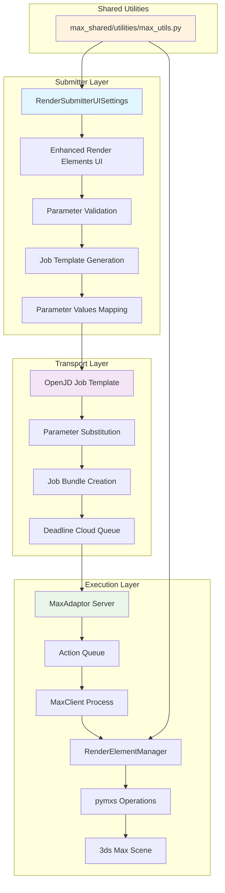
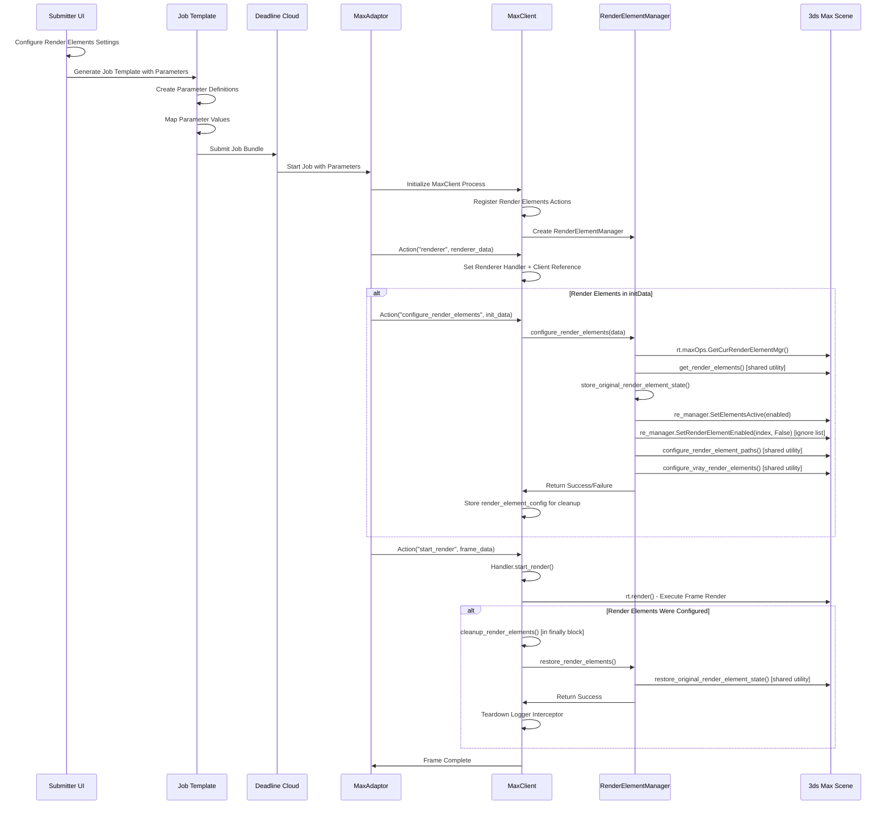

# Render Elements Design Document

## Introduction

Render Elements in 3ds Max are specialized output passes that separate different aspects of the rendered image into individual components for advanced compositing and post-production workflows. These elements allow artists to isolate specific rendering components such as diffuse color, specular highlights, shadows, reflections, and material properties, enabling precise control and adjustment in post-production without re-rendering the entire scene. 3ds Max supports over 90 different render element types, ranging from basic beauty passes to advanced lighting analysis and material separation passes. To read more about Render Elements in 3dsMax, please refer to Autodesk documentation [here](https://docs.chaos.com/display/VMAX/Render+Elements).

Deadline 10 provided comprehensive render elements support with over 90 render element types, advanced path and filename management with naming patterns, V-Ray VFB integration with split buffer support, element ignore functionality by name, and automatic element detection and validation. The system included permanent vs temporary modifications, black frame detection for render elements, and seamless integration with all supported renderers through command-line arguments and MAXScript execution.

## 1. Summary

### What We Are Implementing

We are implementing comprehensive render elements support for AWS Deadline Cloud for 3ds Max, extending the existing basic functionality to match Deadline 10's feature parity. This includes advanced path management, V-Ray integration, element naming patterns, and automatic configuration during rendering. The implementation provides a complete workflow from UI configuration through job submission to render execution with proper state management and restoration.

### What Has Been Implemented

The current implementation provides comprehensive render elements support for Deadline Cloud for 3ds Max through a three-tier architecture. The submitter includes an authentic Deadline 10 UI widget with 8 render element properties matching the original interface exactly. Shared utilities provide consistent pymxs operations for render element detection, validation, and configuration. The adaptor includes full integration with automatic workflow management through the RenderElementManager class and universal render handler support. The system includes complete parameter flow from UI settings through OpenJD job templates to adaptor execution, with proper state backup and restoration, V-Ray VFB control, and comprehensive validation.

## 2. System Architecture

### Block Diagram: Submitter to Adaptor Data Flow



### Sequence Diagram: Complete Render Elements Workflow



## 3. Implementation Summary

The render elements implementation spans three main components in the Deadline Cloud architecture. The submitter was enhanced with RenderElementsWidget providing an authentic Deadline 10 UI interface and RenderSubmitterUISettings data class extended with 8 new render element properties for comprehensive configuration management. The job template generator in create_job_bundle.py was updated to include parameter definitions, parameter values mapping, and the critical parameter flow bridge in _create_step_definitions that ensures all render element settings reach the adaptor execution. The adaptor client was enhanced with MaxClient action registration, RenderElementManager for comprehensive pymxs operations, and DefaultMaxHandler integration that provides automatic render elements configuration and cleanup across all render handlers.

The rest of this document provides an implementation deep dive with detailed code examples, class structures, and technical specifications for each component. Continue reading if you are conducting a code review, debugging implementation issues, or need to understand the technical architecture in detail.

**Section Overview:**
- **Section 4**: Data structure changes including the 8 new render element properties added to RenderSubmitterUISettings
- **Section 5**: Submitter UI changes with RenderElementsWidget implementation and shared utilities for consistent pymxs operations
- **Section 6**: Job template generation changes including parameter definitions, values mapping, and the critical parameter flow bridge
- **Section 7**: Adaptor changes with MaxClient actions, RenderElementManager implementation, and render handler integration

## 4. Data Structure Changes

### RenderSubmitterUISettings Properties

The following properties have been added to support comprehensive render elements functionality:

```python
@dataclass
class RenderSubmitterUISettings:
    # Basic Render Elements (existing)
    render_elements: bool = field(default=True, metadata={"sticky": True})
    ignore_render_elements_by_name: list[str] = field(default_factory=list, metadata={"sticky": True})
    render_element_output_filenames: list[str] = field(default_factory=list)

    # Enhanced Render Elements (NEW - Deadline 10 feature parity)
    render_elements_update_paths: bool = field(default=True, metadata={"sticky": True})
    render_elements_include_name_in_path: bool = field(default=True, metadata={"sticky": True})
    render_elements_include_type_in_path: bool = field(default=False, metadata={"sticky": True})
    render_elements_include_name_in_filename: bool = field(default=True, metadata={"sticky": True})
    render_elements_include_type_in_filename: bool = field(default=False, metadata={"sticky": True})
    original_render_element_names: list[str] = field(default_factory=list)

    # V-Ray Render Element Integration (NEW)
    vray_render_elements_vfb_control: bool = field(default=True, metadata={"sticky": True})
    vray_split_buffer_support: bool = field(default=True, metadata={"sticky": True})
```

**Property Descriptions:**

- `render_elements_update_paths`: Automatically update render element output paths during submission
- `render_elements_include_name_in_path`: Include render element name in the output directory path
- `render_elements_include_type_in_path`: Include render element type (class name) in the output directory path
- `render_elements_include_name_in_filename`: Include render element name in the output filename
- `render_elements_include_type_in_filename`: Include render element type (class name) in the output filename
- `vray_render_elements_vfb_control`: Control V-Ray VFB settings for render elements during rendering
- `vray_split_buffer_support`: Enable V-Ray split buffer functionality for render elements
- `original_render_element_names`: Store original render element names for restoration after submission

## 5. Submitter Changes

### Class: RenderSubmitterUISettings (data_classes.py)

**New Methods:**

- `load_sticky_settings()`: Enhanced to load all new render element properties from persistent storage
- `save_sticky_settings()`: Enhanced to save all new render element properties to persistent storage

### Class: RenderElementsWidget (ui/render_elements_widget.py)

**Authentic Deadline 10 UI Components:**

- `render_elements_checkbox`: QCheckBox for "Output Render Elements"
- `update_paths_checkbox`: QCheckBox for "Update Render Element Paths"
- `include_name_in_path_checkbox`: QCheckBox for "Include Render Element Name in Path"
- `include_type_in_path_checkbox`: QCheckBox for "Include Render Element Type in Path"
- `include_name_in_filename_checkbox`: QCheckBox for "Include Render Element Name in Filename"
- `include_type_in_filename_checkbox`: QCheckBox for "Include Render Element Type in Filename"
- `vray_vfb_control_checkbox`: QCheckBox for "V-Ray Render Elements VFB Control"
- `vray_split_buffer_checkbox`: QCheckBox for "V-Ray Split Buffer Support"
- `ignore_elements_list`: QListWidget for ignored render element names
- `detected_elements_list`: QListWidget showing detected render elements with status indicators
- `add_ignore_btn` and `remove_ignore_btn`: QPushButton for ignore list management
- `refresh_elements_btn`: QPushButton for "Refresh Detected Elements"
- `validation_feedback_label`: QLabel for validation feedback display

**Key Methods:**

- `_build_render_elements_ui()`: Creates the authentic Deadline 10 UI layout in a single unified group box
- `_on_render_elements_changed()`: Handles main render elements checkbox state changes and enables/disables dependent controls
- `_refresh_detected_elements()`: Refreshes detected render elements with enhanced status indicators (🟢🟡🔴❌)
- `_validate_render_elements()`: Comprehensive validation with user feedback
- `_remove_emojis()`: Utility method to clean Unicode emoji characters from element names
- `get_settings_dict()` and `update_settings_from_data_class()`: Bidirectional settings synchronization

### Shared Utilities (max_shared/utilities/max_utils.py)

**Core Functions:**

- `get_render_elements()`: Enhanced render elements detection with comprehensive properties including index, name, type, enabled status, output paths, and V-Ray VFB detection
- `validate_render_element_paths()`: Path validation with accessibility checks and warning generation
- `get_render_elements_output_directories()`: Unique output directory collection for job bundle management
- `purify_render_element_name()`: Name sanitization for file path safety matching Deadline 10 logic
- `configure_render_element_paths()`: Path and filename configuration with naming patterns using `_build_render_element_path()` helper
- `configure_vray_render_elements()`: V-Ray VFB control and split buffer configuration
- `store_original_render_element_state()` and `restore_original_render_element_state()`: Complete state management for render elements
- `validate_render_element_configuration()`: Comprehensive validation combining path, name, and settings validation

**Advanced Functions:**

- `detect_missing_render_elements()`: Missing plugin detection matching Deadline 10's system
- `validate_render_element_names()`: Duplicate name and invalid character validation
- `resolve_duplicate_render_element_names()`: Automatic name resolution suggestions
- `preview_render_element_paths()`: Non-destructive path preview generation
- `analyze_render_element_compatibility()`: Renderer compatibility analysis
- `get_render_element_statistics()`: Comprehensive scene statistics reporting

## 6. Job Template Generation Changes

### Function: get_job_template() (create_job_bundle.py)

**Enhanced Parameter Definitions:**
The function now creates comprehensive OpenJD parameter definitions for all render element features:

```python
def _create_param_definitions(default_job_template, settings, state_sets, cameras_in_scene):
    # Enhanced render element parameters added:
    # - RenderElements (basic enable/disable)
    # - RenderElementsUpdatePaths (path management)
    # - RenderElementsIncludeNameInPath (naming patterns)
    # - RenderElementsIncludeTypeInPath (naming patterns)
    # - RenderElementsIncludeNameInFilename (naming patterns)
    # - RenderElementsIncludeTypeInFilename (naming patterns)
    # - VRayRenderElementsVFBControl (V-Ray integration)
    # - VRaySplitBufferSupport (V-Ray integration)
    # - IgnoreRenderElementsByName (ignore functionality)
```

### Function: get_parameters_values() (create_job_bundle.py)

**Enhanced Parameter Values Mapping:**
The function now maps all UI settings to OpenJD parameter values:

```python
def _get_job_parameters(settings, state_sets):
    # Maps UI boolean settings to OpenJD string values
    parameter_values.append({
        "name": "RenderElementsUpdatePaths",
        "value": "true" if settings.render_elements_update_paths else "false"
    })
    # ... additional parameter mappings for all 8 render element properties
```

### Function: \_create_step_definitions() (create_job_bundle.py)

**Parameter Flow Bridge Implementation:**
The step definitions function creates the critical parameter flow bridge from OpenJD parameters to adaptor execution. This function modifies the job template's `initData` section to include all render element parameters, ensuring they reach the adaptor for processing.

**Implementation Details:**

```python
def _create_step_definitions(job_template, settings, state_sets, cameras_in_scene):
    """
    Creates steps for state sets and includes render element parameters in initData.
    This creates the parameter flow bridge from OpenJD parameters to adaptor execution.
    """
    # Add render element parameters to init data
    render_element_params = [
        "RenderElements", "RenderElementsUpdatePaths",
        "RenderElementsIncludeNameInPath", "RenderElementsIncludeTypeInPath",
        "RenderElementsIncludeNameInFilename", "RenderElementsIncludeTypeInFilename",
        "VRayRenderElementsVFBControl", "VRaySplitBufferSupport",
        "IgnoreRenderElementsByName"
    ]

    for param in render_element_params:
        # Convert parameter name to snake_case for init data with explicit mapping
        param_mapping = {
            "RenderElements": "render_elements",
            "RenderElementsUpdatePaths": "render_elements_update_paths",
            "RenderElementsIncludeNameInPath": "render_elements_include_name_in_path",
            "RenderElementsIncludeTypeInPath": "render_elements_include_type_in_path",
            "RenderElementsIncludeNameInFilename": "render_elements_include_name_in_filename",
            "RenderElementsIncludeTypeInFilename": "render_elements_include_type_in_filename",
            "VRayRenderElementsVFBControl": "vray_render_elements_vfb_control",
            "VRaySplitBufferSupport": "vray_split_buffer_support",
            "IgnoreRenderElementsByName": "ignore_render_elements_by_name",
        }
        init_data_key = param_mapping.get(param, param.lower())
        init_data["data"] += f"{init_data_key}: '{{{{Param.{param}}}}}'\n"
```

**Key Features:**

- **Complete Parameter Flow**: All 9 render element parameters flow from UI → Job Template → Adaptor
- **Explicit Name Mapping**: Uses explicit parameter mapping dictionary for reliable conversion
- **Template Substitution**: Parameters are embedded in initData using OpenJD template syntax `{{Param.ParameterName}}`
- **Verified Implementation**: The parameter flow bridge has been tested and verified to work correctly

## 7. Adaptor Changes

### MaxAdaptor Server Changes

**Action Queue Integration:**
The MaxAdaptor server manages render elements through the existing action queue system without requiring specific changes. Render elements are automatically integrated into the rendering workflow through render handler modifications.

### MaxClient Process Changes

#### Class: MaxClient (MaxClient/max_client.py)

**Render Element Manager Integration:**

```python
def __init__(self, server_path: str) -> None:
    # Initialize render element manager for comprehensive render elements support
    self.render_element_manager = RenderElementManager(self)

    # Register enhanced render elements actions
    self.actions.update({
        "configure_render_elements": self.configure_render_elements,
        "validate_render_elements": self.validate_render_elements,
        "restore_render_elements": self.restore_render_elements,
    })
```

**Action Methods:**

- `configure_render_elements(data: dict)`: Delegates to RenderElementManager for comprehensive configuration with full logging and error handling
- `validate_render_elements(data: dict)`: Non-destructive validation of render element settings
- `restore_render_elements(data: dict)`: Restores render elements to original state after rendering

**Implementation Note:** The actual implementation shows that the MaxClient delegates render element operations to the RenderElementManager class, which handles all the complex pymxs operations using shared utilities.

#### Class: RenderElementManager (MaxClient/render_element_manager.py)

**Core Configuration Method:**

```python
def configure_render_elements(self, data: Dict[str, Any]) -> Dict[str, Any]:
    """
    Comprehensive render element configuration matching Deadline 10.

    Implementation Flow:
    1. Get render element manager: rt.maxOps.GetCurRenderElementMgr()
    2. Detect scene elements: get_render_elements() from shared utilities
    3. Store original state: store_original_render_element_state()
    4. Configure basic settings: re_manager.SetElementsActive(enabled)
    5. Handle ignore settings: re_manager.SetRenderElementEnabled(index, False)
    6. Update paths: configure_render_element_paths() from shared utilities
    7. Configure V-Ray: configure_vray_render_elements() from shared utilities
    8. Validate configuration: validate_render_element_configuration()
    """
```

**Key Implementation Features:**

- **Dual Parameter Support**: Handles both PascalCase (OpenJD) and snake_case parameter names using `_get_param_value()` with fallback lists
- **Comprehensive Logging**: Detailed logging of all operations with parameter values and element information
- **Error Handling**: Robust error handling with success/failure return dictionaries
- **State Management**: Complete original state storage and restoration capabilities
- **Shared Utilities Integration**: Uses shared utilities for consistent behavior with submitter

**Specialized Methods:**

- `_handle_ignore_settings()`: Processes ignore by name list with detailed logging of disabled elements
- `_update_paths_and_filenames()`: Delegates to shared utilities for path configuration
- `_configure_vray_settings()`: Handles V-Ray VFB control and split buffer support
- `_convert_data_to_settings()`: Converts OpenJD parameter format to shared utilities format
- `_get_param_value()`: Multi-name parameter lookup with fallback support

### Render Handler Integration

#### Class: DefaultMaxHandler (render_handlers/default_max_handler.py)

**Render Elements Integration:**
The DefaultMaxHandler integrates render elements through initialization-time configuration and post-render cleanup, rather than per-frame setup.

**Action Registration:**

```python
def __init__(self):
    self.action_dict = {
        # Core rendering actions
        "start_render": self.start_render,
        # Render elements integration actions
        "render_elements": self.configure_render_elements,
        "configure_render_elements": self.configure_render_elements,
        "cleanup_render_elements": self.cleanup_render_elements,
        # Individual parameter actions (no-op, handled by main configure action)
        "render_elements_update_paths": self._no_op_action,
        "vray_render_elements_vfb_control": self._no_op_action,
        # ... other parameter actions
    }
```

**Render Elements Workflow:**

```python
def start_render(self, data: dict) -> None:
    """
    Rendering with automatic render elements cleanup.

    The render elements are configured during initialization via configure_render_elements action.
    This method focuses on rendering and cleanup.
    """
    # Check if render elements were configured during initialization
    render_elements_configured = bool(self.render_element_config)

    try:
        # Execute frame rendering (render elements already configured)
        rt.render(camera=self.camera_node, outputFile=output_path)
    finally:
        # Always restore original state after rendering
        if render_elements_configured:
            self.cleanup_render_elements(data)
```

**Key Methods:**

- `configure_render_elements()`: Stores configuration and calls client's render element manager with logger interceptor setup
- `cleanup_render_elements()`: Restores original state using stored configuration and tears down logger interceptor
- `set_client()`: Sets MaxClient reference for render elements actions
- `_setup_logger_interceptor()` and `_teardown_logger_interceptor()`: Captures render element manager logs for console output
- `_no_op_action()`: Handles individual render element parameters (processed by main configure action)

### Parameter Flow and pymxs Operations

#### Data Conversion Process

```python
# OpenJD Parameter → Adaptor Data Conversion (RenderElementManager)
def _convert_data_to_settings(self, data: Dict[str, Any]) -> Dict[str, Any]:
    """
    Converts OpenJD parameter format to shared utilities format.

    Key Conversions:
    - "RenderElements"/"render_elements": "true" → render_elements: True
    - "IgnoreRenderElementsByName": "Element1,Element2" → ignore_render_elements_by_name: ["Element1", "Element2"]
    - "VRayRenderElementsVFBControl": "true" → vray_render_elements_vfb_control: True
    - Supports both PascalCase (OpenJD) and snake_case parameter names
    """

def _get_param_value(self, data: Dict[str, Any], param_names: List[str], default: str = "") -> str:
    """
    Multi-name parameter lookup with fallback support.
    Tries parameter names in order: ["PascalCase", "snake_case"]
    """
```

#### pymxs Operations Mapping

**Basic Element Control:**

- `_get_param_value(data, ["RenderElements", "render_elements"], "true")` → `rt.maxOps.GetCurRenderElementMgr().SetElementsActive(True)`

**Ignore Settings:**

- `_get_param_value(data, ["IgnoreRenderElementsByName", "ignore_render_elements_by_name"], "")` → Parse comma-separated list → `re_manager.SetRenderElementEnabled(index, False)` for each ignored element

**Path Management:**

- `_get_param_value(data, ["RenderElementsUpdatePaths", "render_elements_update_paths"], "true")` → Calls `configure_render_element_paths()` from shared utilities
- Path building uses `_build_render_element_path()` with naming pattern settings
- Final path update: `re_manager.SetRenderElementFilename(index, new_path)`

**V-Ray Integration:**

- `_get_param_value(data, ["VRayRenderElementsVFBControl", "vray_render_elements_vfb_control"], "true")` → Calls `configure_vray_render_elements()` from shared utilities
- V-Ray VFB control: `element.vrayVFB = not vfb_control` (inverted logic - disable VFB when control is enabled)

### Universal Render Handler Support

All render handlers automatically inherit render elements functionality through the base pattern established in DefaultMaxHandler:

**Base Implementation Pattern:**

- **DefaultMaxHandler**: Complete render elements integration with action registration, client reference management, logger interceptor, and cleanup workflow
- **Other Handlers**: Inherit the same pattern through the `set_client()` method and action registration system

**Integration Mechanism:**

- `set_client()` method provides MaxClient reference to all handlers
- Action registration includes render elements actions in the handler's action_dict
- Logger interceptor captures render element manager logs for console output
- Automatic cleanup ensures original state restoration after rendering

**Renderer-Specific Considerations:**
The render element manager's compatibility analysis function (`analyze_render_element_compatibility()`) provides renderer-specific validation, warning about potential incompatibilities between render elements and the current renderer. This ensures that V-Ray elements are flagged when using Corona renderer, etc.
