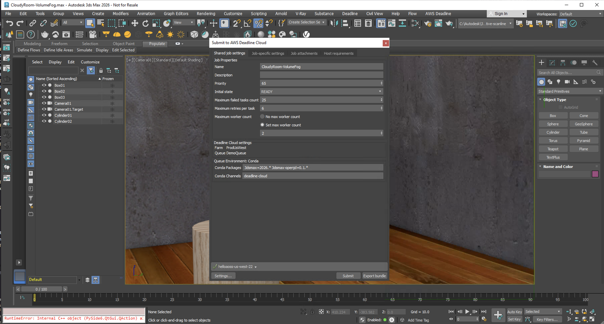

# AWS Deadline Cloud for Autodesk 3dsmax User Guide

This guide provides step-by-step instructions for using AWS Deadline Cloud with Autodesk 3dsmax to render your projects faster by distributing rendering tasks across multiple machines.

## What's Inside

This user guide covers:

- [Fleet Host Configuration](fleet-host-configuration.md) - How to configure Deadline Cloud Fleets for Autodesk 3ds Max Jobs.
- [Installation](installation.md) - How to install the Autodesk 3ds Max submitter
- [Using the Submitter](using-submitter.md) - How to prepare and submit rendering jobs

## Support

Need help or have feedback? Here's how to get support:

1. **[Report a bug or issue](https://github.com/aws-deadline/deadline-cloud-for-3ds-max/issues)** - Report a bug or issue with the 3dsmax adapter or submitter
2. **[Discussion forum](https://github.com/aws-deadline/deadline-cloud-for-3ds-max/discussions)** - Add any feature requests, questions and the team can help support you!