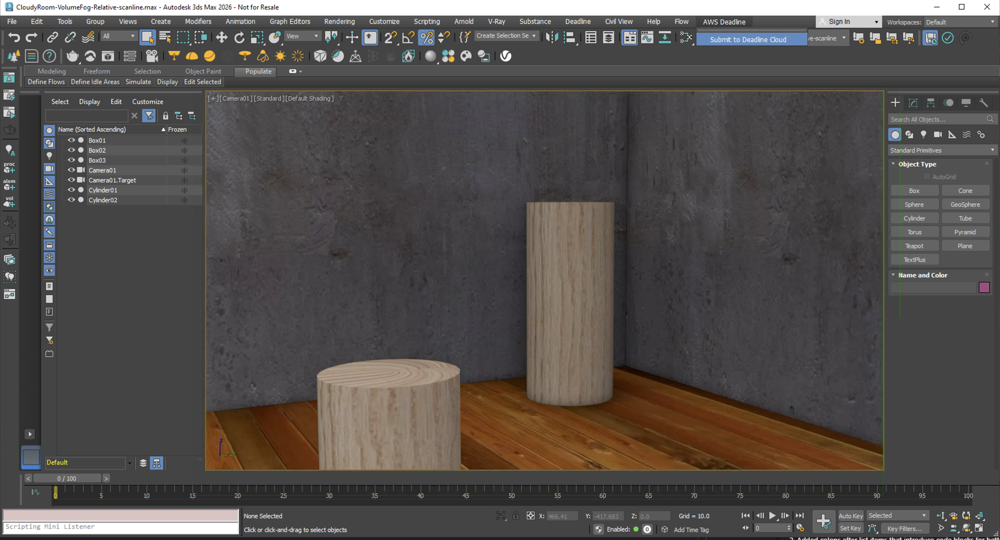
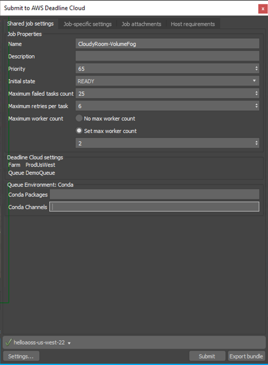
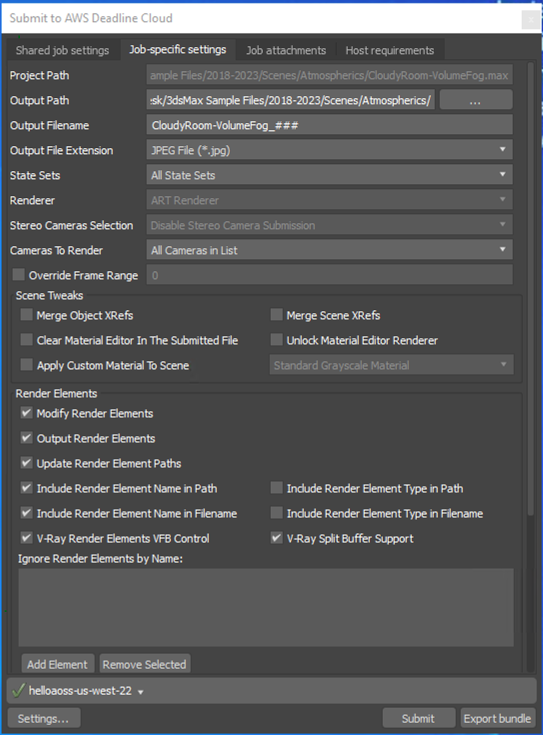

# Using the Autodesk 3ds Max Submitter

To use the Deadline Cloud submitter for 3ds max, please ensure your Farm is configured with a 3dsmax capable fleet, and have the submitter installed. Also, please log into the Deadline Cloud Monitor or provide AWS credentials via a configuration profile for Deadline Cloud access.

Refer to the [fleet-host-configuration.md](fleet-host-configuration.md) and [installation.md](installation.md) to configure the fleet and 3dsmax application.

## Submit a job

**To submit a job from 3ds Max to Deadline Cloud**

1. Save your 3ds Max file.
1. In 3dsMax's menu, choose **Deadline Cloud**. Refer to the image above for reference.
1. Use the tabs in the dialog to customize your job.
1. (Optional) To export a job's associated files to your job history directory without submitting it, choose **Export bundle**.
    - A _job bundle_ is a group of files that defines a job. For more information, see [Open Job Description templates for Deadline Cloud](https://docs.aws.amazon.com/deadline-cloud/latest/developerguide/build-job-bundle.html).
1. Choose **Submit** and follow the prompts to send your job to Deadline Cloud.

### Shared Job Settings

Settings that apply to the entire job:

- **Farm Selection** - Choose which farm your job will render on
- **Queue Selection** - Select the specific queue within your chosen farm
- **Job Name** - Give your render job a descriptive name
- **Job Description** - Add optional details about your render job
- **Priority** - Set job priority for queue management
- **Initial State** - Control whether the job starts immediately or remains paused
- **Max Failed Tasks Count** - Maximum number of tasks that can fail before the job is marked as failed
- **Max Retries Per Task** - Number of times a failed task will be retried
- **Max Worker Count** - Maximum number of workers that can work on this job simultaneously
- **Conda Packages** - Note that this must be EMPTY as 3dsmax does not use Conda.
- **Conda Channels** - Note that this must be EMPTY as 3dsmax does not use Conda.

### 3ds Max Specific Settings

Settings specific to 3ds Max rendering:

- **Project Path** - The 3ds Max project path (automatically detected)
- **Output Path** - Directory where rendered images will be saved
- **Output Filename** - Base name for rendered image files. Use ### to represent the frame number.
- **Output File Extension** - File format for rendered images (e.g., .exr, .png, .jpg)
- **State Sets** - Select which 3ds Max State Set to use for rendering
- **Renderer** - Current renderer from 3ds Max render settings (read-only)
- **Stereo Cameras Selection** - Choose stereo camera rendering options if stereo plugin is available
- **Cameras To Render** - Select specific cameras or render all cameras
- **Override Frame Range** - Optionally override the scene's frame range with custom values

#### Scene Tweaks

Options to modify the scene during submission:

- **Merge Object XRefs** - Merge external object references into the scene
- **Merge Scene XRefs** - Merge external scene references into the scene
- **Clear Material Editor In The Submitted File** - Remove materials from the material editor
- **Unlock Material Editor Renderer** - Unlock the material editor renderer
- **Apply Custom Material To Scene** - Apply a custom material to all scene objects

#### Render Elements

Render Elements in 3ds Max are specialized output passes that separate different aspects of the rendered image into individual components for advanced compositing and post-production workflows. These elements allow artists to isolate specific rendering components such as diffuse color, specular highlights, shadows, reflections, and material properties, enabling precise control and adjustment in post-production without re-rendering the entire scene. Deadline Cloud for 3ds Max provides comprehensive render elements support with advanced path management, V-Ray integration, and automatic configuration during rendering.

Enhanced render elements support with the following options:

- **Modify Render Elements** - Enables any changes to render element settings for this scene. If selected, the following options will be applied at render time.
- **Output Render Elements** - Control Enable/Disable render elements output
- **Update Render Element Paths** - Automatically update output paths during submission
- **Include Name/Type in Path** - Add render element names or types to output directory paths
- **Include Name/Type in Filename** - Add render element names or types to output filenames
- **V-Ray Specific Settings** - VFB control and split buffer support for V-Ray render elements
- **Ignore Render Elements by Name** - Exclude specific render elements from output

For information about the other submitter tabs, see the [AWS Deadline Cloud guide for using a submitter](https://docs.aws.amazon.com/deadline-cloud/latest/userguide/jobs-using-submitter.html).

## Monitoring your jobs

You can monitor job progress using the Deadline Cloud monitor. For more information, see the [AWS Deadline Cloud guide for using the monitor](https://docs.aws.amazon.com/deadline-cloud/latest/userguide/working-with-deadline-monitor.html).

## Known Limitations

### Maximum number of state sets / batch views per job

The [Open Job Description (OpenJD) specification](https://github.com/OpenJobDescription/openjd-specifications/wiki/2023-09-Template-Schemas) limits a job to a maximum of 50 job parameters. Because the submitter creates per-step parameters for each state set or batch view, this places a practical ceiling on how many can be included in a single job submission.

The submitter uses a fixed set of global parameters, plus per-step parameters that scale with the number of state sets or batch views:

| Parameter group | Count |
|---|---|
| Base parameters (scene file, error checking) | 2 |
| Camera parameter (when a specific camera is selected) | 0 or 1 |
| Render element parameters (when scene has render elements) | up to 10 |
| Per state set in Default mode (frames, output path/name/format, resolution) | 6 each |
| Per batch view in Batch Render mode (frames, output path/name/format, resolution, camera, scene state, preset, pixel aspect) | 10 each |

The practical limits are:

| Submission mode | Render elements | Specific camera | Max per job |
|---|---|---|---|
| Default | No | No | 8 state sets |
| Default | No | Yes | 7 state sets |
| Default | Yes | No | 6 state sets |
| Default | Yes | Yes | 6 state sets |
| Batch Render | No | N/A | 4 batch views |
| Batch Render | Yes | N/A | 3 batch views |

Submitting a job that exceeds 50 parameters will fail with a validation error. If you need to render more state sets or batch views than the limit allows, split them across multiple job submissions.

## Getting help

- Contact AWS Support
- For bugs, please log an [issue to our github](https://github.com/aws-deadline/deadline-cloud-for-3ds-max/issues) (Requires a GitHub account)
- For feature requests or improvement ideas, visit our [discussion forum](https://github.com/aws-deadline/deadline-cloud-for-3ds-max/discussions)